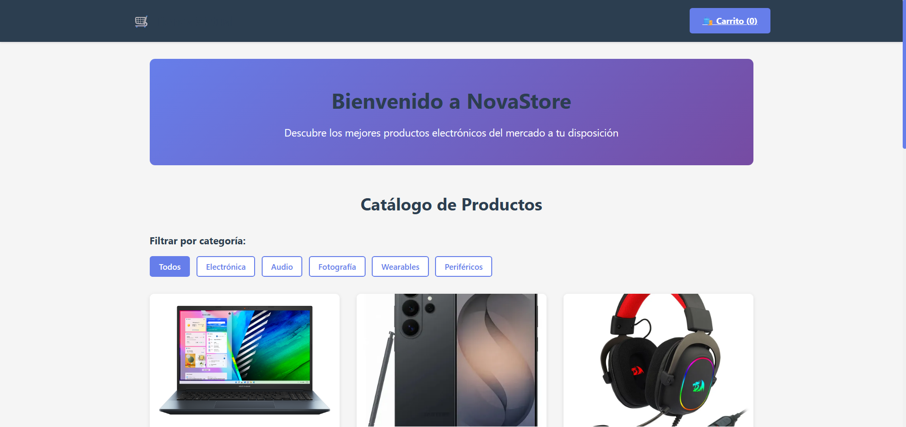
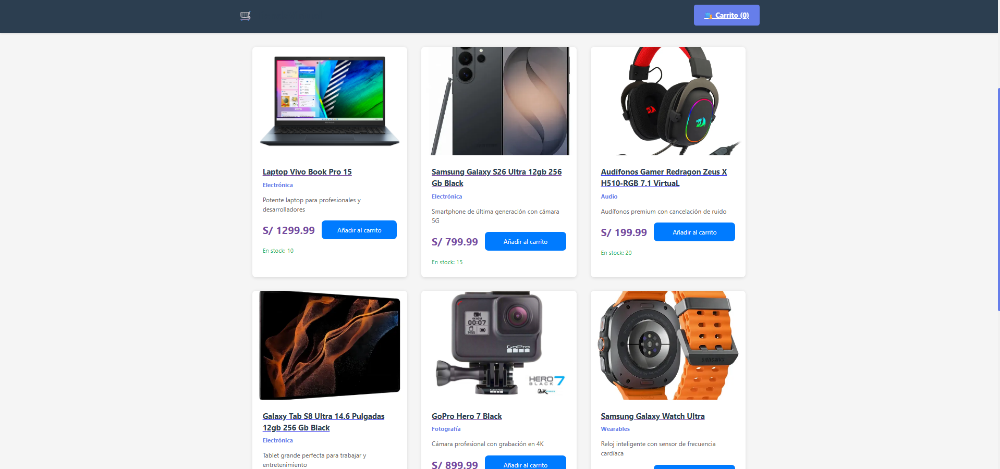
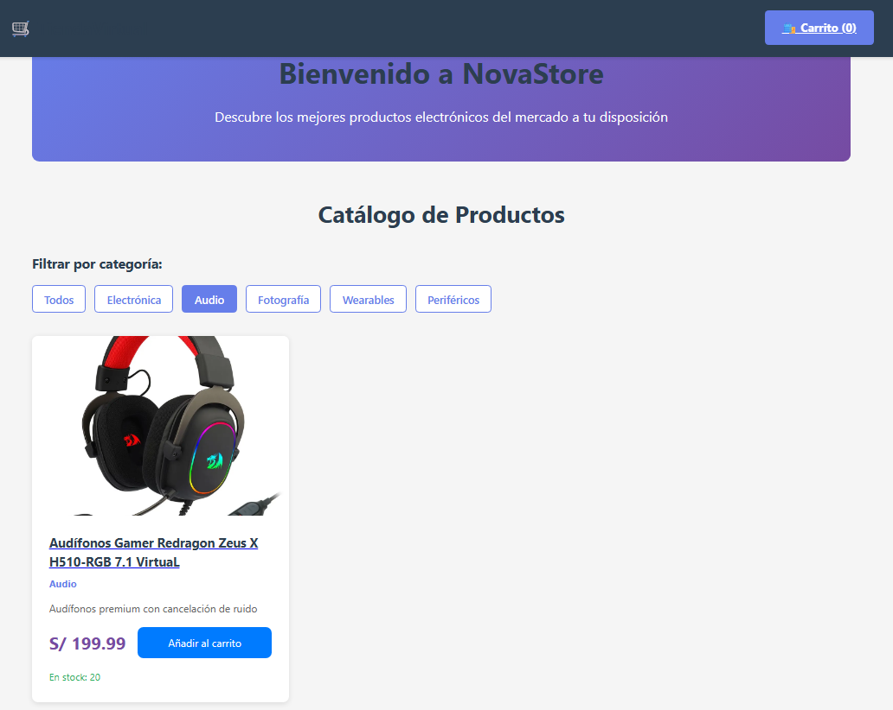
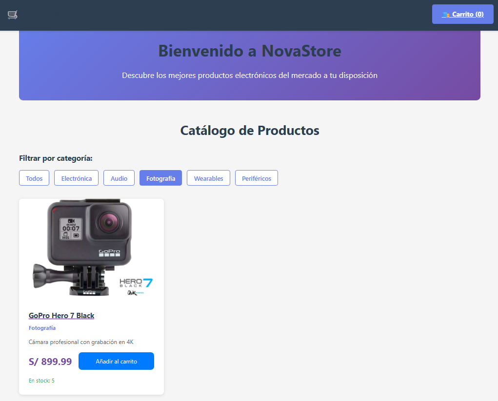
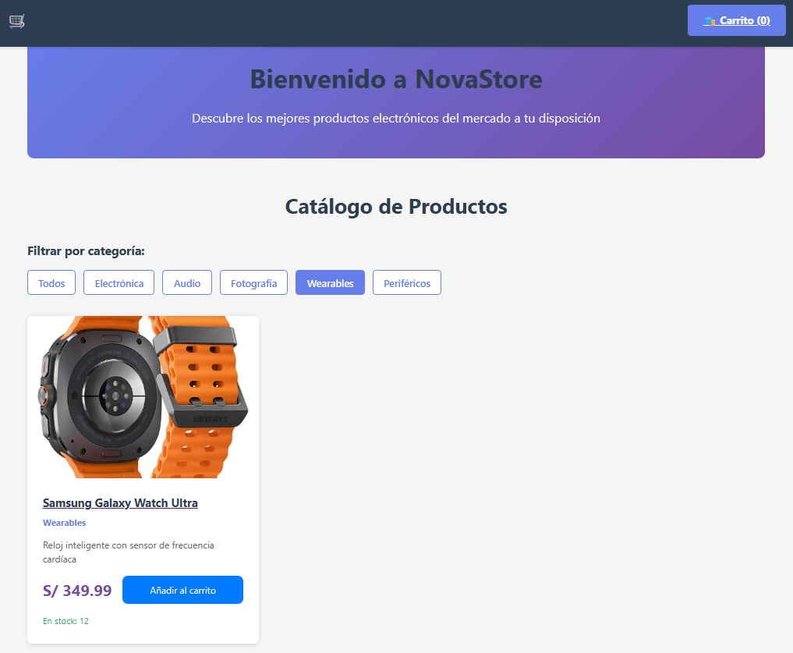
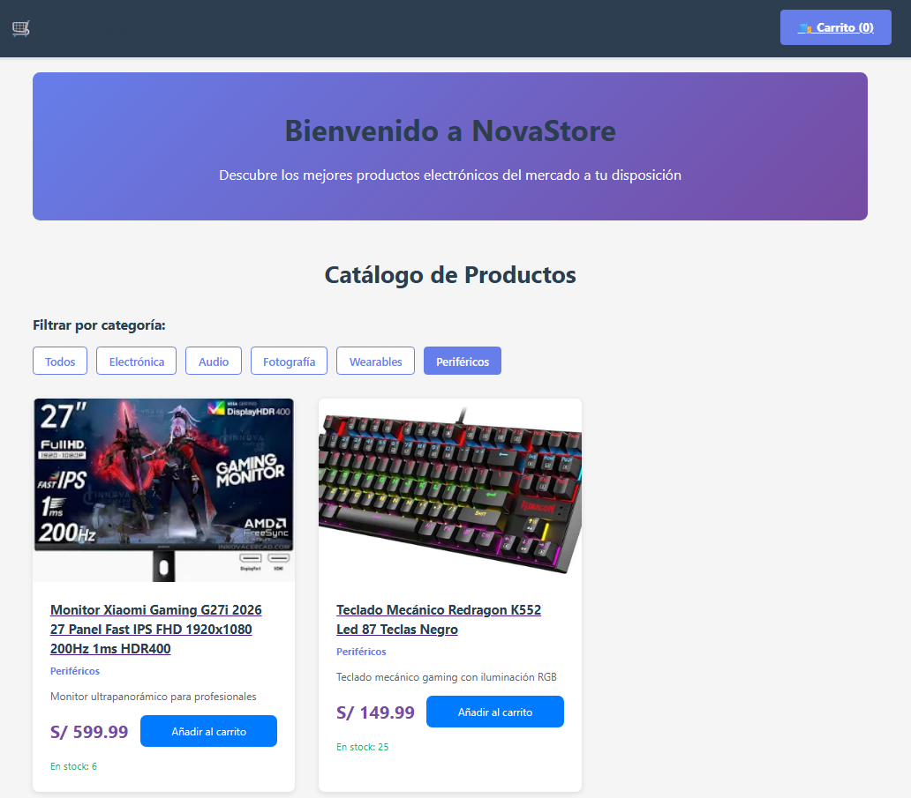
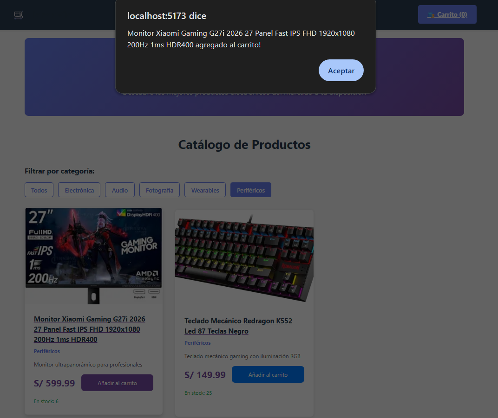
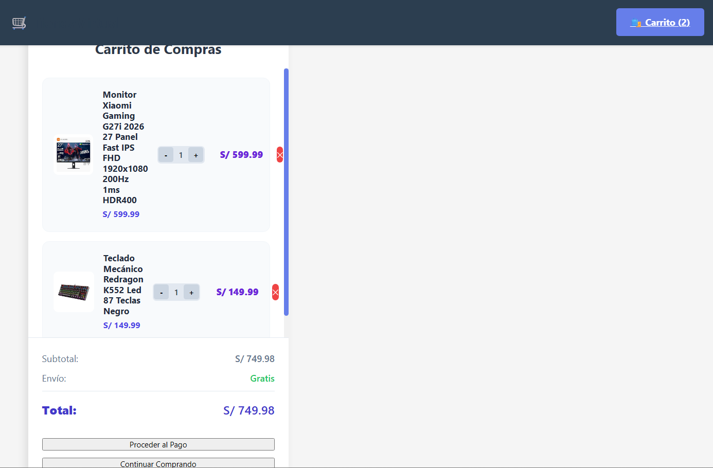
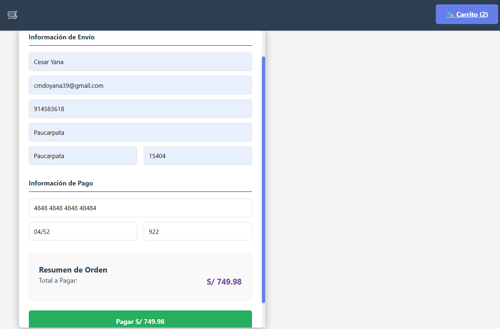
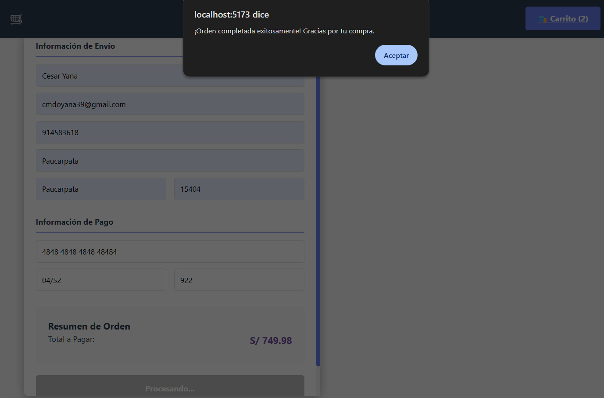

# NovaStore - Tienda Virtual

NovaStore es una aplicación web desarrollada con React que simula una tienda virtual de productos electrónicos. Permite navegar por categorías, ver productos, agregarlos al carrito y realizar un proceso de compra simulado.

---

## Tecnologías utilizadas

- React
- React Router DOM
- Context API
- JavaScript (ES6+)
- CSS3
- Vite

---

## Capturas del proyecto

### Inicio 1
Página principal de NovaStore donde se muestra la interfaz inicial con acceso a las categorías de productos.


### Inicio 2
Segunda parte del inicio con productos destacados y navegación principal de la tienda.


### Electrónica
Catálogo de productos electrónicos disponibles como laptops, smartphones y tablets.


### Audio
Sección dedicada a dispositivos de audio como audífonos, parlantes y accesorios.


### Fotografía
Muestra cámaras y equipos fotográficos disponibles en la tienda.


### Wearables
Productos tecnológicos portátiles como relojes inteligentes y pulseras fitness.


### Periféricos
Accesorios para computadora como teclados, mouse y otros dispositivos.


### Añadir producto al carrito
Acción donde el usuario agrega un producto seleccionado al carrito de compras.


### Carrito de compras
Vista general de los productos agregados, con cantidades y precios totales.


### Datos bancarios
Formulario donde el usuario ingresa información de pago para la compra simulada.


### Procesar compra
Confirmación del proceso de compra y finalización del pedido.


### Vista general
Resumen completo de la tienda mostrando su estructura y funcionamiento general.


---

## Instalación del proyecto

```bash
git clone https://github.com/osmartumeflores/Proyecto_Fase_1_TE-.git
cd Proyecti_Fase_1_TE-
npm install
npm install react-router-dom
npm run dev